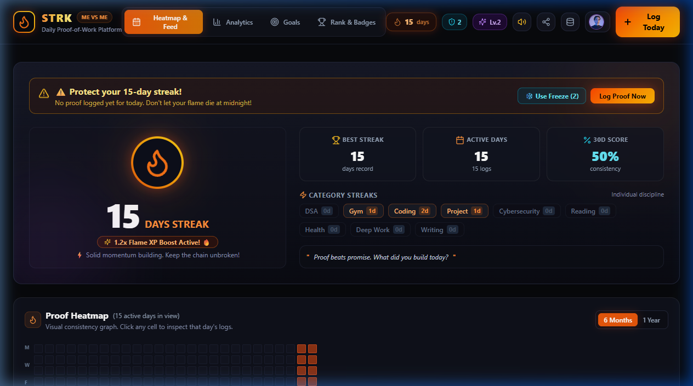
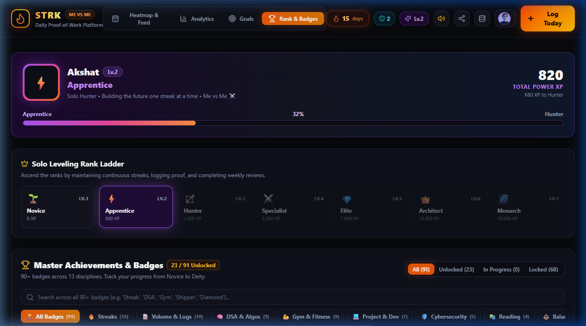
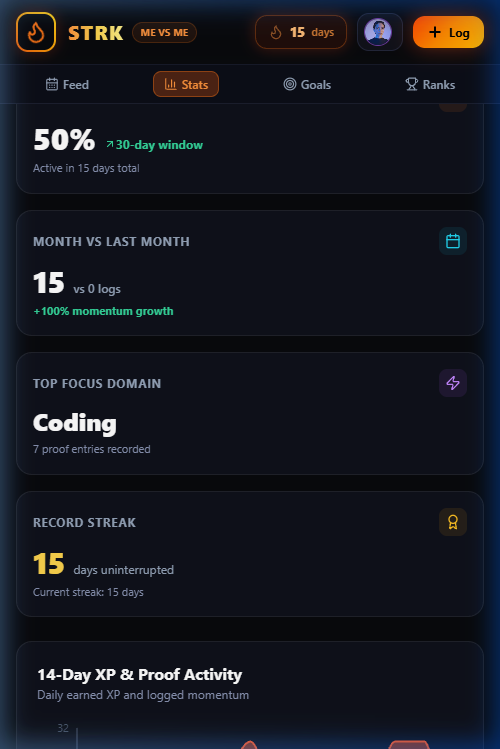
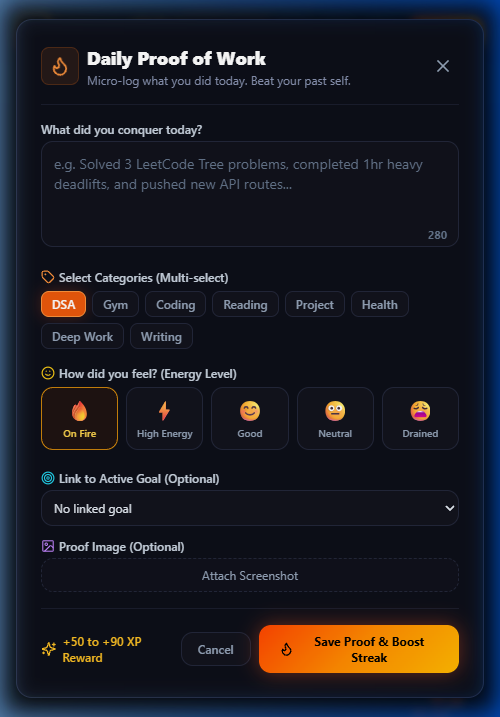
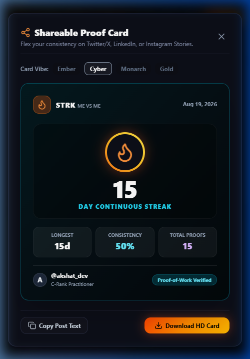

<div align="center">

# 🔥 STRK — "Me vs Me"
### The Gamified Personal Accountability & Consistency Engine

[](https://strkworld.netlify.app)
[](https://github.com/akshattiwarii/STRK)
[](https://nextjs.org/)
[](https://www.typescriptlang.org/)
[](https://supabase.com/)
[](https://tailwindcss.com/)
[](LICENSE)

<br />

**"Competition is with yourself, not with anyone else."**  
*Duolingo-style Streaks + Twitter Build-in-Public Micro-Logs + GitHub Contribution Heatmap + Solo Leveling Hunter Ranks.*

<br />



</div>

---

## ⚡ The Philosophy

Most goal trackers fail because they demand long, tedious journal entries and offer zero psychological leverage. 

**STRK operates on pure Behavioral Psychology & Loss Aversion:**
1. **Daily Proof-of-Work**: 280-character micro-logs. Submit what you did today with optional screenshot proof.
2. **Visual Proof of Grind**: A GitHub-style contribution matrix that lights up with glowing embers on active days.
3. **Loss Aversion Hook**: Breaking a 50-day streak triggers an emotional loss — keeping you showing up even on low-motivation days.
4. **Solo Leveling Rank Progression**: Earn XP on every log, multiply XP with long streaks, and level up from *E-Rank Novice* to *S-Rank Shadow Monarch*.

---

## 📸 Visual Showcase

<div align="center">

| 🏆 Solo Leveling Ranks & 90+ Badges | 📱 Native Mobile Experience (390px) |
|---|---|
|  |  |

| 📝 Daily Proof-of-Work Modal | 🎨 Shareable Proof-of-Work Card |
|---|---|
|  |  |

</div>

---

## ✨ Core Features

### 1. 🔥 Centerpiece Streak & Loss-Aversion Shield
* **Active Streak Counter**: Calculates current streaks, best streaks, and 30-day consistency scores.
* **Streak Freeze Tokens**: Earn freeze shields every 7 consecutive days to protect your streak during travel, sickness, or planned rest.
* **Dynamic Loss Warning**: Alerts you when your streak is in jeopardy before midnight.

### 2. 🟩 Interactive GitHub-Style Heatmap Matrix
* 26-week / 52-week glowing contribution calendar.
* Click any day to view all logs, mood ratings, and XP earned on that specific date.
* Auto-focuses on the current week on mobile devices.

### 3. ⚔️ Solo Leveling Gamification & XP Multiplier
Every daily log awards base XP with bonuses for tagging disciplines, writing detailed reflections, and attaching visual proof:

$$\text{Final XP} = (\text{Base XP} + \text{Tag Bonus} + \text{Proof Bonus} + \text{Word Bonus}) \times \text{Streak Multiplier}$$

#### Streak Multipliers:
| Streak Length | Multiplier |
|---|---|
| **Days 1–6** | `1.0x` |
| **Days 7–29** | `1.2x` |
| **Days 30–99** | `1.5x` |
| **Days 100+** | `2.0x` |

#### Hunter Ranks:
* **E-Rank**: Novice, Trainee
* **D-Rank**: Apprentice, Grinder
* **C-Rank**: Disciplined, Consistent
* **B-Rank**: Iron Will, Unstoppable
* **A-Rank**: Elite Hunter, Master
* **S-Rank**: Sovereign, **Shadow Monarch** (10,000+ XP)

### 4. 🏅 90+ Master Badges Directory
Extensive milestone unlocks across **9 specialized categories**:
* 🔥 **Streak Badges** (First Spark, Igniter, Momentum, 100 Club, Immortal)
* 🧠 **Discipline Badges** (LeetCode Hard Grinder, Gym Monster, Full-Stack Shipper, Bug Hunter)
* ⚡ **Time & Secret Badges** (Night Owl, Early Bird, Weekend Warrior, Comeback Kid)

### 5. 🎯 Long-Term Target Milestones
* Connect daily micro-efforts into long-term victories (e.g. *Solve 200 LeetCode Problems*, *Hit 100 Gym Workouts*).
* Automatic progress bars, percentage tracking, and countdown deadlines.

### 6. 📱 100% Mobile Optimized
* Native sticky bottom navigation bar (`Feed`, `Stats`, `Goals`, `Ranks`).
* Anti-zoom inputs, smooth touch gesture momentum, and sticky modal headers with permanent exit buttons.

---

## 🛠️ Tech Stack & Architecture

```text
[ Client (Browser / Mobile) ]
       │
       ▼
[ Next.js 14 App Router + Tailwind CSS ]
       │  (Static Export / SSR on Netlify Edge)
       ▼
[ Cloud Storage Layer ]
       ├── Local-First Cache (Zero latency)
       └── Supabase PostgreSQL Cloud (AWS Global Data Centers)
```

* **Frontend**: [Next.js 14](https://nextjs.org/) (App Router), [React 18](https://react.dev/), [TypeScript](https://www.typescriptlang.org/)
* **Styling**: [Tailwind CSS 3.4](https://tailwindcss.com/), Glassmorphism, Custom Theme Tokens
* **Database & Cloud Backend**: [Supabase](https://supabase.com/) (PostgreSQL Database with RLS)
* **Hosting**: [Netlify Global CDN](https://www.netlify.com/)
* **Icons & Animation**: [Lucide React](https://lucide.dev/), [Canvas-Confetti](https://www.npmjs.com/package/canvas-confetti), Web Audio API

---

## 🚀 Quickstart & Local Setup

### 1. Clone the Repository
```bash
git clone https://github.com/akshattiwarii/STRK.git
cd STRK
```

### 2. Install Dependencies
```bash
npm install
```

### 3. (Optional) Configure Supabase Cloud Backend
Create a `.env.local` file in the root directory:
```env
NEXT_PUBLIC_SUPABASE_URL=https://your-project.supabase.co
NEXT_PUBLIC_SUPABASE_ANON_KEY=your-supabase-publishable-anon-key
```
*(If omitted, STRK runs seamlessly in local-first storage mode with zero setup required).*

### 4. Run Development Server
```bash
npm run dev
```
Open **[http://localhost:3000](http://localhost:3000)** in your browser.

---

## ☁️ Free Cloud Deployment in 2 Minutes

### 1. Database Setup (Supabase)
1. Create a free project at [supabase.com](https://supabase.com).
2. Open **SQL Editor**, paste the SQL from [`supabase/schema.sql`](./supabase/schema.sql), and click **Run**.
3. Copy your **Project URL** and **Publishable Key** from **Project Settings → API**.

### 2. Frontend Hosting (Netlify)
1. Go to [app.netlify.com](https://app.netlify.com) and click **"Add new site" → "Import from GitHub"**.
2. Select this repository (`STRK`).
3. Add your environment variables:
   * `NEXT_PUBLIC_SUPABASE_URL`
   * `NEXT_PUBLIC_SUPABASE_ANON_KEY`
4. Click **Deploy Site** — your live global URL is ready!

---

## 📂 Repository Structure

```text
├── app/
│   ├── globals.css         # Custom animations, glassmorphism & fire glow tokens
│   ├── layout.tsx          # Root HTML & metadata wrapper
│   └── page.tsx            # Main state orchestrator & view controller
├── components/
│   ├── AnalyticsDashboard.tsx  # Interactive stats & Recharts graphs
│   ├── AuthModal.tsx           # Privacy-first Sign In & Create Account modal
│   ├── DataManagementModal.tsx # JSON import/export & backup manager
│   ├── DayDetailModal.tsx      # Date drilldown modal with log deletion
│   ├── GamificationView.tsx    # 90+ badge directory & Hunter Rank tier list
│   ├── GoalsTracker.tsx        # Milestone & target goal manager
│   ├── HeatmapCalendar.tsx     # 52-week contribution matrix with auto-scroll
│   ├── LandingHero.tsx         # Guest landing page
│   ├── LogFeed.tsx             # Filterable chronological daily proof feed
│   ├── Navbar.tsx              # Responsive top bar & sticky mobile bottom nav
│   ├── ProfileModal.tsx        # Private profile & preferences manager
│   ├── QuickLogModal.tsx       # 280-char proof submit modal with XP calculator
│   ├── ShareCardModal.tsx      # Viral PNG proof card generator
│   ├── StreakHero.tsx          # Centerpiece streak counter & loss warning
│   └── WeeklyReflectionModal.tsx # Sunday weekly review & self-discipline score
├── docs/
│   └── screenshots/        # High-resolution UI showcase images
├── lib/
│   ├── auth.ts             # Authentication & session token engine
│   ├── gamification.ts     # XP formulas, multipliers & 90+ badge triggers
│   ├── soundEffects.ts     # Synthesized Web Audio sound cues
│   ├── storage.ts          # Local-first persistence & cloud sync coordinator
│   ├── streakEngine.ts     # Core streak calculation & calendar matrix generator
│   ├── supabaseClient.ts   # Supabase PostgreSQL cloud backend client
│   └── types.ts            # Strict TypeScript interfaces & types
├── supabase/
│   └── schema.sql          # 1-Click PostgreSQL database schema & RLS policies
└── DEPLOYMENT_GUIDE.md      # Comprehensive production deployment walkthrough
```

---

## 🤝 Contributing

Contributions, issues, and feature requests are welcome! Feel free to check the [issues page](https://github.com/akshattiwarii/STRK/issues).

1. Fork the Project
2. Create your Feature Branch (`git checkout -b feature/AmazingFeature`)
3. Commit your Changes (`git commit -m 'V-1.2: add amazing feature'`)
4. Push to the Branch (`git push origin feature/AmazingFeature`)
5. Open a Pull Request

---

## 📜 License

Distributed under the **MIT License**. See `LICENSE` for more information.

<div align="center">

**Built with 🔥 for consistency hunters.**  
*Compete against who you were yesterday.*

</div>
